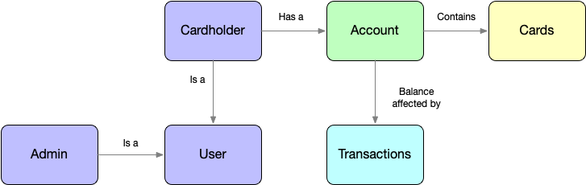

# Table of Contents
1. [Overview](#overview)
2. [Development Environment](#devenv)
3. [DevSecOps](#devsecops)
4. [Service and Ports](#ports)
5. [Sub Projects](#subprojects)
6. [Rest Documenttion](#restdocs)
7. [System Startup](#startup)
8. [Simple Processor](#processor)
9. [Miscellaneous](#miscellaneous)


***     
<br>
<br>


# Overview
### Mr Pickles 3 (Spring Cloud Kubernetes)
To reach the author you can email me at tony.sweets at gmail dot com

### Quick Maven Instructions:
Run Tests - In Sub Project Directory
```
mvn clean test
```


## What is this?
This is a prototype proof of concept application that I use to start new projects. I take what I need and bootstrap a new development project. For this specific proof of concept, the goal is to prototype the transformation of a legacy Spring Framework monolith application into a Spring Boot Microservice Architecture application running in a Kubernetes Cluster. The proof of concept will be built around Spring Cloud Kubernetes. https://spring.io/projects/spring-cloud-kubernetes

I create apps that mostly have some sort of web based UI that talks to a service layer that manipulates, reads, and write data back to a persistence layer.

## The Application
In 2012 I was working in at a startup company and I started a project to create the application that would implement and manage the service they offer. They are a program manager for a payroll debit card. This is essentially a cardholder management platform. It has ran on the AWS Cloud since day one (circa 2012 for the dev/test system) and the production system has seen lots of changes as AWS has grown leaps and bounds since then, however it still doesn't utilize alot of the services that it could be using.  At this point the app is 8 years old and is showing its age. The purpose of this project is to prototype that old Cardholder monolith system as a Microservice based system.  

The legacy application is designed as a Service Oriented Architecture, however that doesn’t mean it directly maps to a Microservice Architecture. The most common mistake I see in the field is that when a project creates microservices, they don’t make them completely autonomous. Meaning that they can’t be deployed and tested independently. Said another way, if I have to care about other services before I deploy a new version of my microservice, then I’m not independently deployable. One of the goals of this project is to explore making the services in the legacy app autonomous. 


### Use Cases
The uses cases that I want to explore are the following:
1. Create Cardholder
2. Create User
3. Create Cardholder
4. Create Account
5. Issue Card to Card Holder
6. Create Card
7. Assign Card to Cardholder
8. Web UI Authentication


### Domain Model
The legacy app has about 100 domain entities, but I do not need to have them all in this proof of concept. Therefor I’m choosing to model:  

 


-	Cardholder
    - Card holder is the client to the company they have and use the Debit Card
-	Administrators
    - This person is someone that can login to the system manage cardholders
-	Account
    - Cardholders have an account. The account tracks the balance of the card. An account can have one or more Cards attached to it. 
-	Card
    - This is payment card (ie Visa/MC) that can used for payments

<br>
<br>

# DevSecOps
Another goal of this project is to implement a DevSecOps pipeline. The original application is being built and deployed with a Jenkins Pipeline. The code is stored in a Nexus Artifact repository. Most of that will stay the same, however in my build environment I will add a Harbor Docker Registry (https://goharbor.io). One of the neat things about Harbor is vulnerability scanning of Docker containers. This will add the "Sec" in my current DevOps pipeline. 

<br>
<br>

# Development Environment <a name="devenv"></a>
Spring and Microservice development is hardware intensive. Currently for this project I use a modern i9 10-Core iMac and i9 6-Core MacBook Pro when I'm away from my lab.  

### Tools:
- Intellij Ultimate 
- VSCode
- Insomnia (REST Client)
- Docker Desktop (includes Kubernetes) 

### Partial List of Technologies used:
- Spring Bootstrap
- Spring Data JPA
- Twitter Bootstrap
- Maven Build/Deploy
- Hibernate
- Spring Security
- Spring MVC
- Spring Web Flow
- Some other cool things

<br>
<br>


# Serivce and Ports <a name="ports"></a>

| Service |  Port |
| ------- | ----- |
| Service Registry | 9000 |
| Config Server	| 9001 |
| API Gateway |	9002 |
| Hystrix | 9295 |
| Simple Processor | 9500 |
| Cardholder | 10001 |
| Card | 10002 |
| User | 10003 |     


<br>
<br>

# Sub Projects <a name="subprojects"></a>
The following is a listing of the directories (Maven Projects) in the project and thier purpose
							
### **card-service**
Microservice for the Card domain

### **cardholder-service**
Microservice for the Cardholder domain

### **config-server**
Configuration Server for the microservice system implemented with Spring Cloud Config

### **gateway**
API Gateway for the microservice system implemented with Spring Cloud Gateway and includes a **Circuit Breaker** functionality

### **hystrix-dashboard**
Dashboard application for Hystrix (Service to Service Traffic analysis)

### **service-registry**
Dynamic Service Registry implemented with Eureka 

### **simple-processor**
Fake/Test Card Processor - not production - Test Env Only

### **user-service**
Microservice for the User domain (cover's cardholders and admins)  

<br>
<br>

# Rest Documentation <a name="restdocs"></a>  
### Swagger Info
Each microservice has it's own REST Documentation. This documentation is implemented with OpenAPI 3.0 and includs built in swagger UI. The access the docs - access the running Microserver on its normal port and add /swagger-ui.html to the URL for example the user microservice REST docs are available at:
```
url http://localhost:10003/swagger-ui.html
```

<br>
<br>

# System Startup <a name="startup"></a>
The System needs to be started in order. Each project is it's own maven java project that includes the Spring Boot plugin. To run the system manually, you cd in the the appropriate directory and run
``` 
mvn spring-boot:run
```
Order is below
1. Service Registry (Eureka)
2. Config Server (Spring Cloud Config)
3. API Gateway
4. Hystrix
5. Simple Processor (for testing)
6. User Service
7. Card Service
8. Cardholder Service


<br>
<br>


# Simple Card Processor <a name="processor"></a>
Typically, the Card Processor would be external to the program manager system and would be accessed over a secured API. however, since I don’t have a real “card processor” to connect to, I am creating my own Simple Card Processor. For Simplicity sake, this will be another deployment in the K8S. I won’t call this a microservice, however it will use Discovery and the Gateway.  Some of the features of the Simple Processor are:
-	Track Card
-	Add Funds
-	Remove Funds

<br>
<br>

# Miscellaneous
### URLs to remember 
Service Registry - http://localhost:9000/   
Config Server – http://localhost:9001/foo/default   
API Gateway – http://localhost:9002  
Hystrix - http://localhost:9295/hystrix  

### Zipkin Server 
Zipkin is a distributed call tracing system and is usefull for debugging the distributed nature of a microservice application. This is not a Spring Boot app but a server that is ran via a public Docker container.  
```
docker run -d -p 9411:9411 openzipkin/zipkin
```
URL = http://localhost:9411/zipkin/

#### TODOs
-	Create Standalone Profile
-	Docker Files
-	Docker Compose File


